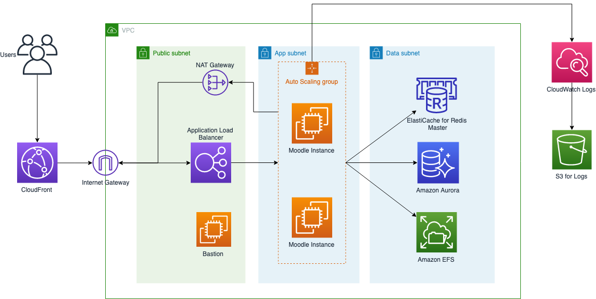

# Moodle on AWS

Moodle은 교육자, 관리자 및 학습자에게 개인화 된 학습 환경을 만들기 위해 강력하고 안전하며 완전한 시스템을 제공하도록 설계된 학습 플랫폼입니다.

## 아키텍쳐




## 배포 설명

아키텍처를 이해하려면 다음 지침을 인증하고 읽으십시오.

1. ICP에서 제출 한 도메인 이름을 준비합니다. AWS 중국의 CloudFront는 액세스를 위해 ICP에 등록 된 도메인 이름이 필요합니다 .CloudFront를 활성화하도록 선택한 경우 ICP에 등록 된 도메인 이름을 미리 준비하십시오.

1. 유동 IP의 잔량을 확인합니다. CloudFormation 스택은 고 가용성 아키텍처를 보장하기 위해 선택한 각 가용 영역 (AZ)에서 NAT 게이트웨이를 활성화합니다. 각 NAT 게이트웨이는 탄력적 IP에 바인딩되어야합니다. 기본적으로 계정은 탄력적 IP 5 개에만 적용 할 수 있습니다. CloudFormation 스택을 시작하기 전에 남아있는 유연한 IP 할당량이 충분한 지 확인하십시오. 남은 유동 IP 할당량이 부족한 경우 작업 주문을 통해 증가를 신청할 수 있습니다.

1. SSL 인증서를 AWS Identity and Access Management (IAM)에 업로드합니다. 프로덕션 환경에서는 HTTPS를 활성화하기 위해 CloudFront 및 ALB (Application Load Balancer) 모두에 대해 SSL 인증서를 구성하는 것이 좋습니다. SSL을 활성화하려면이 솔루션을 배포하기 전에 SSL 인증서를 AWS IAM에 업로드하십시오. 다음 AWS CLI 명령을 사용하여 SSL 인증서의 ID 및 ARN을 볼 수 있습니다.
    ```bash
    aws iam list-server-certificates
    ```

2. CloudFormation 스택을 시작할 때 ** 최소 및 최대 ASG (Auto Scaling Group) 값을 1로 설정 ** 합니다. 세션 캐싱을 설정했다면 Moodle을 처음 설치할 때 다음과 같은 오류가 발생할 수 있습니다
    ```
    Installation must be finished from the original IP address, sorry.
    ```

3. 스택이 배포 된 후 웹 사이트로 이동하여 Moodle 설치를 완료합니다. 참고 : 설치 마법사의 마지막 단계 (관리자 암호 설정 후)에서 504 게이트웨이 시간 초과 또는 CloudFront 오류가 발생할 수 있습니다. 설치를 완료하려면 페이지를 새로 고치기 만하면됩니다.

4. Moodle 사이트 관리에서 구성 Application Cache를 설정합니다。

5. 이제 방금 배포 한 스택을 ** 업데이트 ** 하고 필요에 따라 ** 최소 및 최대 Auto Scaling 그룹 ** 값을 설정할 수 있습니다.。

6. 비용을 절감하기 위해 애플리케이션 캐시와 세션 캐시가 Redis 클러스터를 공유하도록하려면 CloudFormation 스택에서 애플리케이션 캐시를 활성화하지 않도록 선택할 수 있습니다. Moodle 사이트 구성에서 응용 프로그램 캐시와 세션 캐시를 동일한 캐시 저장소로 구성합니다.

## 1 단계 : CloudFormation 스택 시작

이 자동화 된 AWS CloudFormation 템플릿은 AWS 클라우드에 Moodle 애플리케이션을 배포합니다.
이 솔루션을 실행할 때 사용되는 AWS 서비스 비용은 귀하의 책임입니다. 자세한 내용은 "요금"섹션을 참조하십시오. 자세한 내용은이 솔루션에 사용될 각 AWS 서비스의 요금 페이지를 참조하십시오.
Moodle Application Cache와 Session Cache가 동일한 Redis Cluster를 사용하도록하려면 Session Cache 만 배포하도록 선택한 다음 Moodle 사이트의 콘솔을 통해 구성 할 수 있습니다.
Application Cache를 배포하기로 선택한 경우 Moodle 사이트가 배포 된 후 구성하려면 Moodle 콘솔에 로그인하십시오.

1. AWS Management Console에 로그인하고 아래 버튼을 클릭하여 AWS CloudFormation 템플릿을 시작합니다.
    [](https://cn-northwest-1.console.amazonaws.cn/cloudformation/home?region=cn-northwest-1#/stacks/create/template?stackName=Moodle&templateURL=https:%2F%2Faws-solutions-reference.s3.cn-north-1.amazonaws.com.cn%2Fmoodle-on-aws%2Flatest%2F00-master.template)
    
1. 기본적으로 템플릿은 AWS Ningxia 리전에서 시작됩니다. 다른 AWS 리전에서 솔루션을 시작하려면 콘솔 탐색 모음에서 리전 선택기를 사용하십시오.

1. ** Create Stack ** 페이지에서 ** Amazon S3 URL ** 텍스트 상자에 올바른 템플릿 URL이 표시되는지 확인하고 ** Next ** 를 선택합니다.

1. ** 스택 세부 정보 지정 ** 페이지에서 솔루션 스택에 이름을 할당합니다.

1. ** 매개 변수 ** 에서 템플릿의 매개 변수를보고 필요에 따라 수정합니다. 이 솔루션은 다음 기본값을 사용합니다.

    **General AWS**

    | 매개 변수        | 기본값     | 설명                                                 |
    | --------------- | --------- | ----------------------------------------------------- |
    | EC2 Key Pair    |           | EC2 Key Pair 名称，用于登录 Web 实例 |
    | SSH Access From | 0.0.0.0/0 | 允许登录 Bastion 的 IP 地址段 (CIDR格式)              |
    | Site Domain     |           | Moodle 站点域名                                       |

    **Network**

    | 매개 변수                     | 기본값         | 설명                                                          |
    | ---------------------------- | ------------- | ------------------------------------------------------------ |
    | Number of Availability Zones | 3             | 创建 VPC 时使用的 AZ 数量. 这个数量必须与 Availability Zones 中选择的数量一致 |
    | Availability Zones           |               | Subnet 使用的 AZ.                                            |
    | VpcCidr                      | 10.0.0.0/16   | VPC CIDR                                                     |
    | VpcTenancy                   | default       |                                                              |
    | Public Subnet 0              | 10.0.200.0/24 | Public Subnet 0 在 AZ0 中的 CIDR                             |
    | Public Subnet 1              | 10.0.201.0/24 | Public Subnet 1 在 AZ1 中的 CIDR                             |
    | Public Subnet 2              | 10.0.202.0/24 | Public Subnet 2 在 AZ2 中的 CIDR                             |
    | Web Subnet 0                 | 10.0.0.0/24   | Web Subnet 0 在 AZ0 中的 CIDR                                |
    | Web Subnet 1                 | 10.0.4.0/24   | Web Subnet 1 在 AZ1 中的 CIDR                                |
    | Web Subnet 2                 | 10.0.8.0/24   | Web Subnet 2 在 AZ2 中的 CIDR                                |
    | Data Subnet 0                | 10.0.100.0/24 | Data Subnet 0 在 AZ0 中的 CIDR                               |
    | Data Subnet 1                | 10.0.101.0/24 | Data Subnet 1 在 AZ1 中的 CIDR                               |
    | Data Subnet 2                | 10.0.102.0/24 | Data Subnet 2 在 AZ2 中的 CIDR                               |

    **File System Tier**

    | 매개 변수             | 기본값          | 설명                                      |
    | -------------------- | -------------- | ---------------------------------------- |
    | EFS Performance Mode | generalPurpose | 文件系统的性能模式                          |
    | Encrpyted EFS?       | false          | 是否加密 EFS                             |
    | Add dummy data (GiB) | 0              | 在 EFS 中增加 dummy data                 |
    | Instance Type        | r4.large       | 在 EFS 中增加 dummy data 的 EC2 实例大小 |

    **Database Tier**

    |매개 변수            | 기본값       | 설명                |
    | ------------------ | ----------- | ------------------ |
    | DB Instance Class  | db.r5.large | 数据库实例大小     |
    | DB Master Username | moodle      | Master 用户名      |
    | DB Master Password |             | Master 用户密码    |
    | DB Name            | moodle      | RDS 默认数据库名称 |

    **Caching Tier**

    | 매개 변수                                      | 기본값          | 설명                                                 |
    | --------------------------------------------- | -------------- | ---------------------------------------------------- |
    | Use Session Cache                             | true           | Moodle 是否启用 Session Cache                        |
    | Session Cache Node Type                       | cache.r5.large | ElastiCache 实例大小                                 |
    | Use Application Cache                         | false          | Moodle 是否启用 Application Cache                    |
    | Application Cache Node Type                   | cache.r5.large | ElastiCache 实例大小                                 |
    | Use CloudFront                                | false           | 是否创建 CloudFront                                  |
    | CloudFront Certificate ID uploaded in AWS IAM |                | CloudFront 使用的 SSL 证书ID, 必须提前上传到 AWS IAM |

    **Web Tier**

    | 매개 변수               | 기본값    | 설명                                          |
    | ---------------------- | -------- | --------------------------------------------- |
    | Public ALB Domain Name |          | ALB 自定义域名                                |
    | ALB Certificate ARN    |          | ALB 使用的 SSL 证书ID, 必须提前上传到 AWS IAM |
    | Web Tier Instance Type | c5.large | Web 实例大小                                  |
    | Web ASG Max            | 1        | Web Auto Scaling Group 最大值                 |
    | Web ASG Min            | 1        | Web Auto Scaling Group 最小值                 |

    **Moodle**

    | 매개 변수      | 기본값  | 설명                 |
    | ------------- | ------ | ------------------- |
    | Language Code | en     | Moodle 站点默认语言 |

2. 选择**下一步**。

3. 在**配置堆栈选项**页面上，选择“下一步”。

4. 在**审核**页面上，查看并确认设置。 确保选中确认模板将创建 AWS Identity and Access Management（IAM）资源的框。

5. 选择**创建堆栈**以部署堆栈。

您可以在AWS CloudFormation控制台的**状态**列中查看堆栈的状态。 您应该在大约30分钟内看到状态为CREATE_COMPLETE。

## 步骤2: 配置 CloudFront 和 ALB CNAME

通过如下步骤找到 ALB 和 CloudFront 的 DNS Name. 如何配置 CNAME 记录取决于您使用的 DNS Resolver. 

1. 登录到 AWS 管理控制台，并选择进入 CloudFormation 控制台。

1. 选择步骤1中创建的 CloudFormation 主堆栈（请不要选择 NESTED 堆栈）。

1. 点击**输出**。

1. **PublicAlbDnsName** 为 ALB DNS Name, **CloudFrontDnsName** 为 CloudFront DNS Name.

登录到您的 DNS Resolver 控制台，配置域名指向这两处 DNS Name。


## 构建自己的解决方案

点击查看[文档](build.md)

